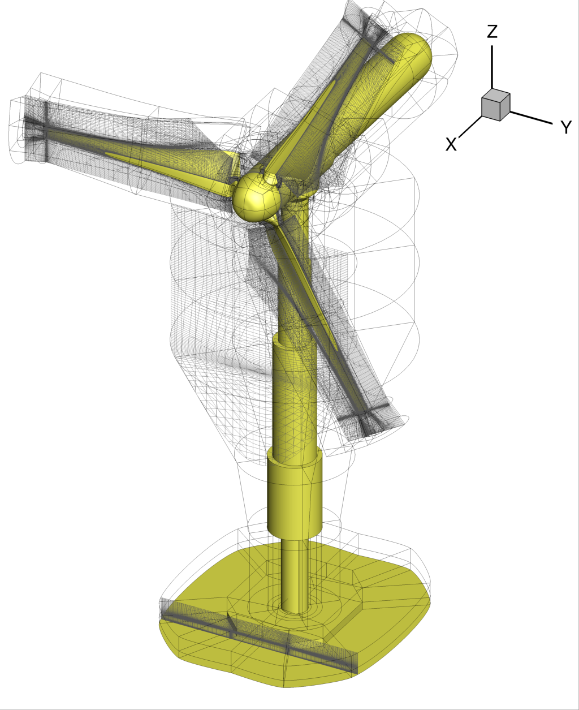

# NTNU-BTs-CNR-INSEAN

[Creative Commons Attribution 4.0](http://creativecommons.org/licenses/by/4.0/) license

On-going research activities on

> Horizontal Axis Wind Turbines (HAWT) CFD simulations

CNR-INSEAN CFD simulations reproducing the NTNU Blind Tests experiments.

---

[Repository organization](#repo) ♺ [Simulation setup](#setup) ♺ [Preliminary results](#results) ♺ [References](#references) ♺ [Copyrights](#copyrights) ♺ [Authors](#authors)

---

### Repository organization
This online repository is organized as following:

+ `root`: the root of all;
+ `root/images`: images displayed into this readme;
+ `root/README.md`: this readme;
+ `root/src`: all sources files to build Xnavis inputs;

---

### Simulation setup

To be written.

||
|----------------------------------|
| Figure 1: Turbine 2 overview |

---

### Results

To be written.

---

### References

[1] *Performance and near wake measurements of a model horizontal axis wind turbine*, Krogstad, Per-Åge and Adaramola, Muyiwa S., Wind Energy, vol. 15, n. 5. pp. 743--756, 2012, John Wiley & Sons, Ltd,, http://dx.doi.org/10.1002/we.502.

[2] *Blind Test 2 calculations for two in-line model wind turbines where the downstream turbine operates at various rotational speeds*, Fabio Pierella, Per-Åge Krogstad, Lars Sætran, Renewable Energy, vol. 70, 2014, pp. 62--77, ISSN 0960-1481, http://dx.doi.org/10.1016/j.renene.2014.03.034.

[3] *Blind Test 3 calculations of the performance and wake development behind two in-line and offset model wind turbines*, Per-Åge Krogstad, Lars Sætran, Muyiwa Samuel Adaramola, Journal of Fluids and Structures, vol. 52, 2015, pp. 65--80, ISSN 0889-9746, http://dx.doi.org/10.1016/j.jfluidstructs.2014.10.002.

---

### Copyrights

The content of this project itself is licensed under the [Creative Commons Attribution 4.0](http://creativecommons.org/licenses/by/4.0/) license.

---

### Authors

+ Andrea Di Mascio, [andreadimascio](https://github.com/andreadimascio);
+ Riccardo Broglia, [rbroglia](https://github.com/rbroglia);
+ Roberto Muscari, [rmuscari](https://github.com/rmuscari);
+ Federico Porcacchia, [FedericoPorcacchia](https://github.com/FedericoPorcacchia).
+ Stefano Zaghi, [szaghi](https://github.com/szaghi).

